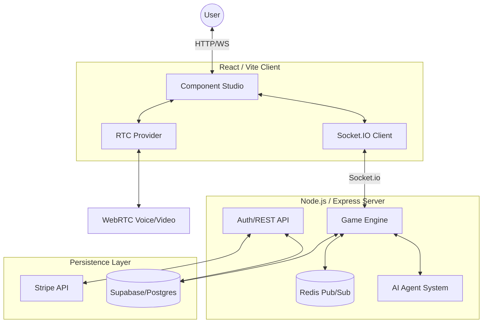
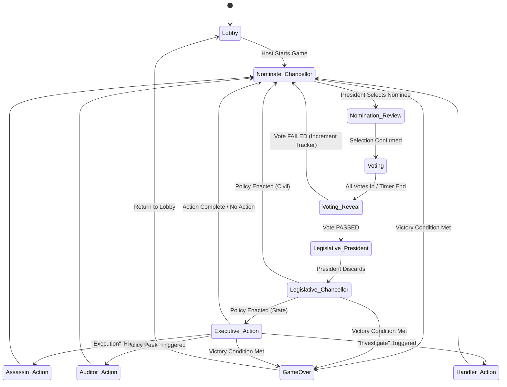

# The Assembly

**The Assembly** is a high-fidelity, real-time social deduction engine designed for high-stakes competition and Discord Activity integration.

Built with a focus on performant state synchronization and premium design, The Assembly combines a complex Bayesian AI system with a reactive React frontend and a Node.js backend.

---

## 🏗 System Architecture

The project is structured as a monolithic server serving both a REST API and a real-time Socket.IO game engine, with a Vite-powered React frontend.



### Core Architecture Components
- **Game Engine**: Centralized authority for game state transitions, policy shuffling, and role assignments.
- **AI System**: Bayesian-based agents capable of complex suspicion modelling, legislative strategy, and natural chat banter.
- **Redis Integration**: Used for cross-process synchronization and reliable room state management.
- **Supabase**: Handles multi-factor authentication, user profiles, friends lists, and match history.

---

## 🎮 Game Phase State Machine

The game flows through a series of discrete phases, each governed by specific timeout logic and player availability.



---

## 🛠 Environmental Configuration

| Variable | Description | Default |
| :--- | :--- | :--- |
| `APP_URL` | The base URL of the application. | `http://localhost:3000` |
| `JWT_SECRET` | Secret key for signing authentication tokens. | - |
| `SUPABASE_URL` | Your Supabase project endpoint. | - |
| `SUPABASE_SERVICE_ROLE_KEY` | High-privilege key for server-side database ops. | - |
| `REDIS_URL` | Connection string for the Redis instance. | `redis://localhost:6379` |
| `STRIPE_SECRET_KEY` | API key for processing payments. | - |
| `DISCORD_CLIENT_ID` | OAuth2 Client ID for Discord integration. | - |
| `TURN_URL` | WebRTC TURN server endpoint for NAT traversal. | - |
| `TURN_SECRET` | Shared secret for dynamic WebRTC credentials. | - |

---

## 🤝 Contribution Guide

We welcome contributions to The Assembly! To ensure code quality and system stability, please follow these guidelines:

### Development Workflow
1. **Branch Management**: Create feature branches from `main`. Name them `feat/feature-name` or `fix/bug-name`.
2. **Type Safety**: All new code MUST be strictly typed. Avoid `any` at all costs.
3. **Linting**: Run `npm run lint` before committing.
4. **Testing**: Add unit tests for new `GameEngine` logic or `AI_WEIGHTS` modifications.

### Coding Standards
- **Styling**: Use Vanilla CSS variables and semantic classes. Avoid Tailwind unless requested.
- **Logging**: Use the structured `logger` on the backend and `debugLog/debugError` on the frontend.
- **Security**: Always validate incoming socket payloads with the established Zod schemas in `server/schemas.ts`.

---

## 🚀 Getting Started

1. **Install Dependencies**
   ```bash
   npm install
   ```

2. **Setup Environment**
   ```bash
   cp .env.example .env
   # Populate .env with necessary keys
   ```

3. **Launch dev environment**
   ```bash
   npm run dev
   ```

The application will be accessible at [http://localhost:3000](http://localhost:3000).
